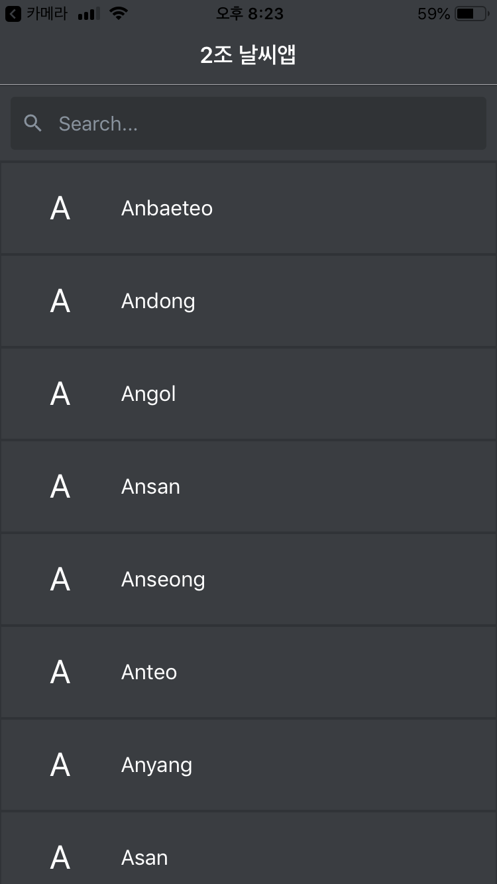
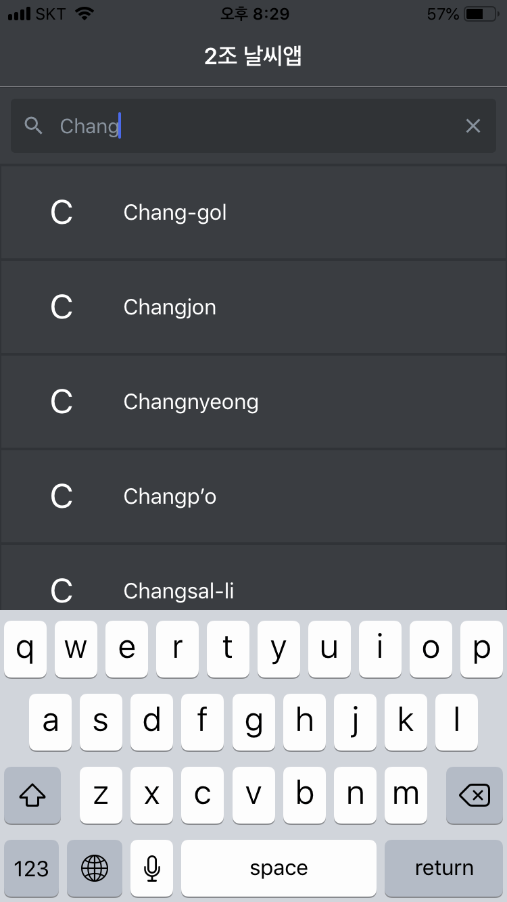
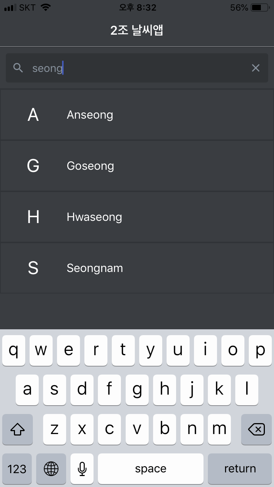
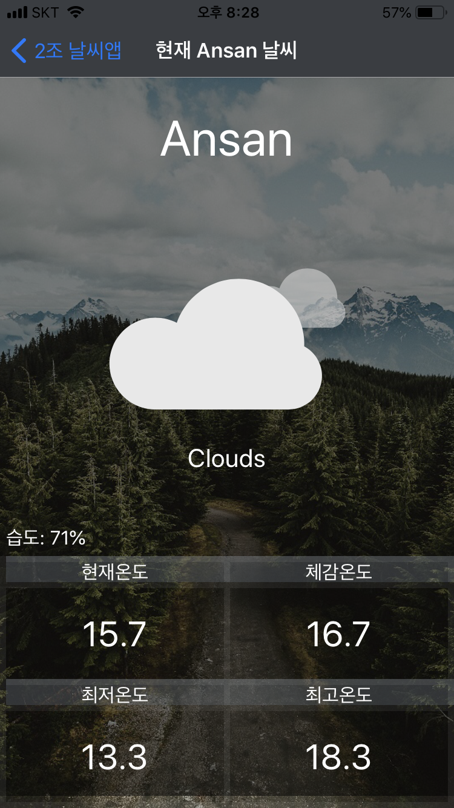
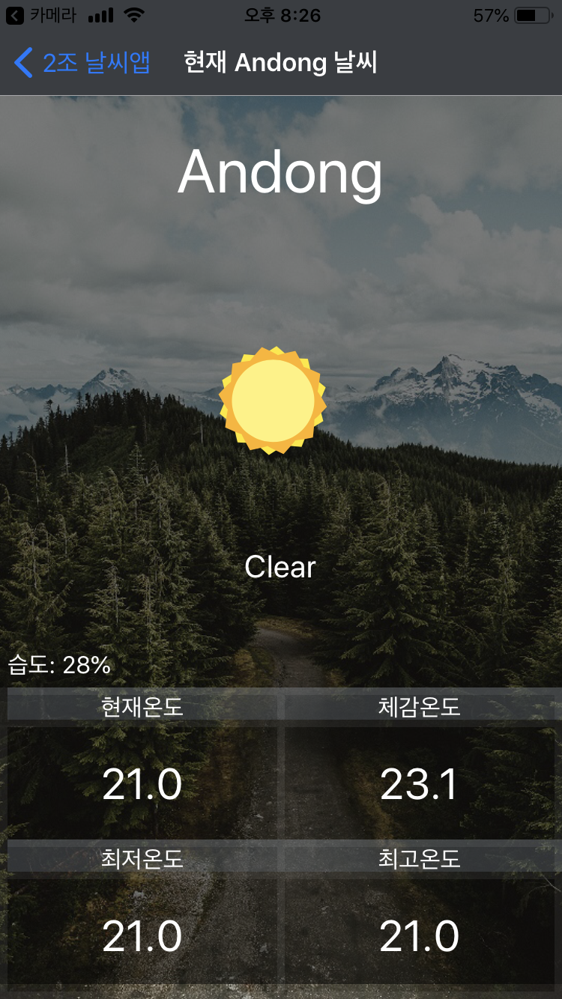
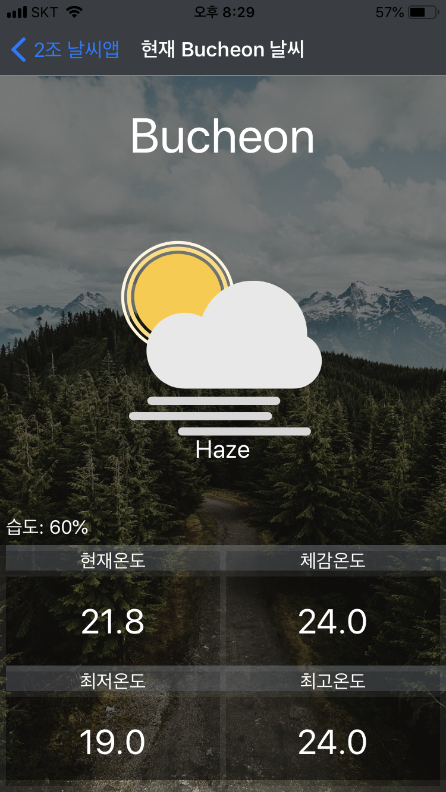

## React-Native Weather Project

### 개요

  React-native를 이용한 Cross-Platform 어플리케이션 제작

#### 충남대학교 컴퓨터 공학과 강좌 실전코딩을 통해 배운 React-Native 및 OpenWeatherAPI를 통해 local 서버에서 받아온 API 정보를 표시하는 어플리케이션

### Environment

  React-Native  
  Node.js v10.15  
  Npm 6.9.0  
  Expo-Cli  
  React-native-component, React-native-searchbar, lottie-react-native  

### 자료 출처
- OpenWeatherAPI :  `https://openweathermap.org/api`  
- lottiefiles(For Animation) : `https://lottiefiles.com/`  
- Unsplash (For Image Download) : `https://unsplash.com/`  

### What Makes For User eXperience?
#### 1. 화면 색감
- 기존의 하얀색 화면에서 보다 눈이 덜 피로한 검은색 배경을 지원합니다.

#### 2. 검색 기능
- 자신이 살고 있는 도시를 빠르게 확인하기 위한 검색 기능 추가  

- 단어의 일부만 입력해도 검색이 가능합니다.

#### 3. 애니메이션

- 애니메이션 이미지를 통해 날씨를 보다 쉽게 알아볼 수 있습니다.

#### 4. 체감온도
- 기상청에서 제공하는 체감온도 공식을 통해 체감온도 역시 표시되도록 수정하였습니다.

